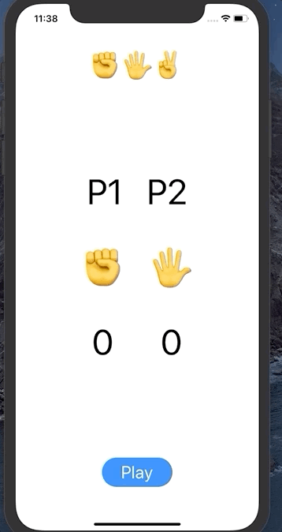

# WWC iOS Collab and Code Challenges
9-21-2020

iOS and Swift are a little different of a collab and code challenge. You have to first know the basics about the programming language Swift, and later you can begin learning iOS Development! These challenges are broken into Swift and then iOS development for easy/medium/hard.

You MUST have a Mac, and download Xcode from the Mac App Store, to do the iOS challenges. (Note: download Xcode on Wi-Fi prior to the event, it can take a while sometimes).

## Swift Challenges
If you don’t have a Mac or iPad, with Swift Playgrounds installed, you can use this [online playground](https://repl.it/repls/UsefulFamiliarReference) instead.

[This video series](https://www.youtube.com/playlist?list=PLMRqhzcHGw1b89DXHOVA77ozWXWmuBkWX) is great to get started learning the syntax of the language. If you prefer documentation, here’s the official [Swift docs](https://docs.swift.org/swift-book/LanguageGuide/TheBasics.html).

I would suggest using a Mac or Apple iPad with playgrounds, if you’re able to. The autocorrect on the online editor isn’t as good.

All starter/solution files can be [found here](https://github.com/mikaelacaron/iOS-Collab-and-Code/tree/master/Swift%20Challenges).

## Easy
1. Create 2 variables and write their sum to the output window in playgrounds.
2. Create a function that takes two strings as arguments and return either true or false depending on whether the total number of characters in the first string is equal to the total number of characters in the second string.
3. Create a function that takes a number as an argument and returns "even" for even numbers and "odd" for odd numbers.

## Medium
1. Create a protocol called Toggalable with a mutating function called toggle. Create an enum OnOffSwitch that conforms to Toggalable. Switch on and off a light switch variable
2. Unwrap the optional parameter in the starter project and use it in a function to return a string.
3. Your program is a vending machine, see starter code. Make  a function called vend, that throws various VendingMachineError errors, noted at the top. This link may be useful, about throwing functions.
## Hard
1. Write  a function that prints numbers 1 to 100. If the number is divisible by 3 print fizz. If it is divisible by 5 print buzz. If it is divisible by both, print fizz buzz.
   * Ex: 1, 2, fizz, 4, buzz, fizz, 7, 8, 9, buzz, 11, fizz, 13, 14, fizzbuzz
2. Create an enumeration of the planets. Make that enum conform to CaseIterable, and print all the cases
3. Write a function with a trailing closure

## iOS Challenges
These challenges are to be completed <b>in order</b>. Each one builds off of each other. Here are some [tutorials](https://www.youtube.com/playlist?list=PLMRqhzcHGw1ZkH8RuznGMS0NZs0jWQQ5a)
## Easy
1. Create the UI shown below. The top is a label, the middle is a label, and the bottom is a button.
2. Create an array, called rpsChoices, with 3 strings in it. The elements of the array are the 3 emojis, rock, paper, and scissors. Create a variable called randomNumber1 and set it equal to 0.
3. Create an IBOutlet for the middle label, called player1. Create an IBAction for the touch up inside event of the play button, called playButtonTapped.
## Medium
1. In the playButtonTapped function set the variable randomNumber1, equal to random number between 0 to 2.
2. Use randomNumber1 to access that element in the array, and set the text of the player1 equal to the element in the array.
## Hard
1. Add a second player, following the second UI design below.
2. Add the same functionality as step (Easy-3, Medium-1 and Medium-2) for the second player
3. Create a function to choose the winner, and add to each score label, depending on which player won
4. BONUS! Use a UIAlertController to indicate which player won, when the score reaches 5, and then reset the game.

# Pictures
## Demo

## Easy-1 UI

## Hard-1 UI

